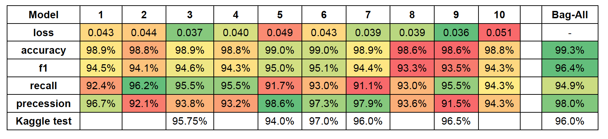

# COVID-19 X-ray image classification: COVID-19 cases classification from chest X-ray images

The Coronavirus Disease 2019 (COVID-19) has brought a worldwide threat to the living society. The whole world is putting incredible efforts to fight against the spread of this deadly disease. During the recent global urgency, scientists, clinicians, and healthcare experts around the globe keep on searching for a new technology to support in tackling the Covid-19 pandemic. Meanwhile, hundreds of machine-learning experts volunteer their time and expertise to help medical researchers in this fight. One of the areas where machine learning can help is detecting the COVID-19 cases from chest X-ray images. The task is a simple classification problem where given an input chest X-ray image, the machine learning-based model must detect whether the subject of study has been infected or not. This project is ongoing research now, and many scientists are working on this problem. Recently the researchers from the University of Waterloo and Darvin.ai developed one of the successful models for this task called Covid-Net. They gathered a dataset for training their model, where we use a modified version of that dataset here to do a similar task. In this data challenge, we will tackle the same problem, and maybe your model can help medical researchers to diagnose the COVID-19 cases more efficiently. Given a supervised dataset of X-ray images, train a model to detect the COVID-19 cases.

This dataset consists of 15264 (512x512) chest X-ray images for the train set and 400 images for the test set. The dataset contains positive and negative classes to indicate the positive and negative COVID-19 cases. You can find some examples of this dataset below:

Link to the dataset: https://www.kaggle.com/c/stat946winter2021/data

Tasks:
- Data Loading and Preparation 
  - The first two steps of the notebook include loading data and preparing train/validation sets. First, it will create a set of new directories “MZarei/” in which the data will be unzipped and split into train/validation sets. Also, it has been used for saving final trained model. Several transform function have been tested but finally just `transforms.Grayscale(3)` and `transforms.RandomHorizontalFlip(p=0.5)` are kept. Also, to alleviate the unbalanced nature of data a weighted sampler (8 to 1 ratio based on the class ratio of train set) has been used through data loader. 

- Define Train/Evaluate Functions and Model Architecture 
  In the steps 3, Train and Evaluate functions are defined based on the uploaded tutorial in Pizza. Evaluate function provides accuracy, f1 score, recall and precision of model over validation set (10% of data). I tested the impact of using weighted loss to manage unbalanced classes but better models were obtained without it. Also, I used Mixup augmentation method which shows a great improvement in the model but requires more epoch number. 
In step 4, a classifier head is added to a pretrained AlexNet (several pretrained models like Vgg16, GoogleNet, SqueezeNEt have been tested but AlexNet was chosen finally). Up to epoch= 6, only the weights of classifier head will be updated during training and after that all weights will be adjusted based on backpropagation.

- Train Model
  - Model training initiates in step 5 and the best model is selected based on F1 criteria. Running the training process several times has shown that we can get F1≈0.93-0.95 and around 99% accuracy on validation set. I tried to fix random seeds so that the trained models can be reproducible, but it seems it is impossible as there are too many randomness in Pytorch so during each run new models will be obtained. So the final trained model may have around 1-2% lower accuracy than my best models (model1 to model 10 in Models folder) that come with this document (those model are being trained with exactly same process but are selected after several runs and monitoring model performance over validation set).

- Use Model for Test Data
  - In step 6, the best trained model on the basis of largest F1 score over validation set can be used for predicting test data. Due to randomness of training process the final accuracy of best model over test set may be a bit lower than leader board scores (it should be around 95-97%). In the following, the performance of 10 best models over my validation set are presented (all are available in MZareiFolder/DL1_MZarei/Models). These models have exactly same architecture/hyperparameters and have been trained with same train set. An interesting observation is that using bagging method over all models provides better results than each individual model (this can be tested in the last two parts of the notebook). However, the performance of bag-model is worse than the performance of best individual model over the test data in Kaggle. The best model in terms of Kaggle test is model6.pt with 97% accuracy. The reason for this may be because of relatively low number of test data.

