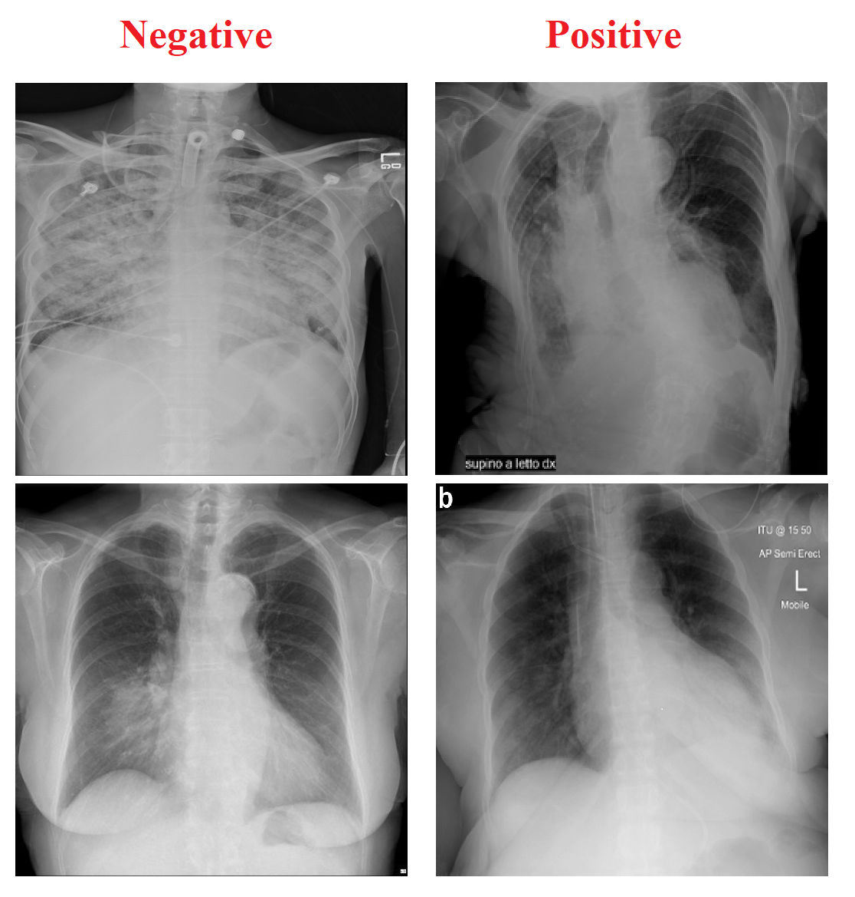

# COVID-19 X-ray image classification: COVID-19 cases classification from chest X-ray images

The Coronavirus Disease 2019 (COVID-19) has brought a worldwide threat to the living society. The whole world is putting incredible efforts to fight against the spread of this deadly disease. During the recent global urgency, scientists, clinicians, and healthcare experts around the globe keep on searching for a new technology to support in tackling the Covid-19 pandemic. Meanwhile, hundreds of machine-learning experts volunteer their time and expertise to help medical researchers in this fight. One of the areas where machine learning can help is detecting the COVID-19 cases from chest X-ray images. The task is a simple classification problem where given an input chest X-ray image, the machine learning-based model must detect whether the subject of study has been infected or not. This project is ongoing research now, and many scientists are working on this problem. Recently the researchers from the University of Waterloo and Darvin.ai developed one of the successful models for this task called Covid-Net. They gathered a dataset for training their model, where we use a modified version of that dataset here to do a similar task. In this data challenge, we will tackle the same problem, and maybe your model can help medical researchers to diagnose the COVID-19 cases more efficiently. Given a supervised dataset of X-ray images, train a model to detect the COVID-19 cases.

This dataset consists of 15264 (512x512) chest X-ray images for the train set and 400 images for the test set. The dataset contains positive and negative classes to indicate the positive and negative COVID-19 cases. You can find some examples of this dataset below:

Task:
- Download all parts of the dataset from the data section.
- Design a neural network that gets the images from the input and predicts the labels of the images in the output.
- Train your neural network using the train dataset.
- Predict the correct labels of test data and submit your prediction file. You can find a sample submission file and its format in the data section (Note that later you also need to submit your codes in the learn and your submission file must be reproducible by your code)

